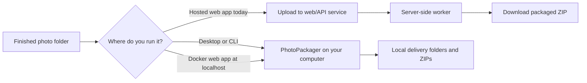
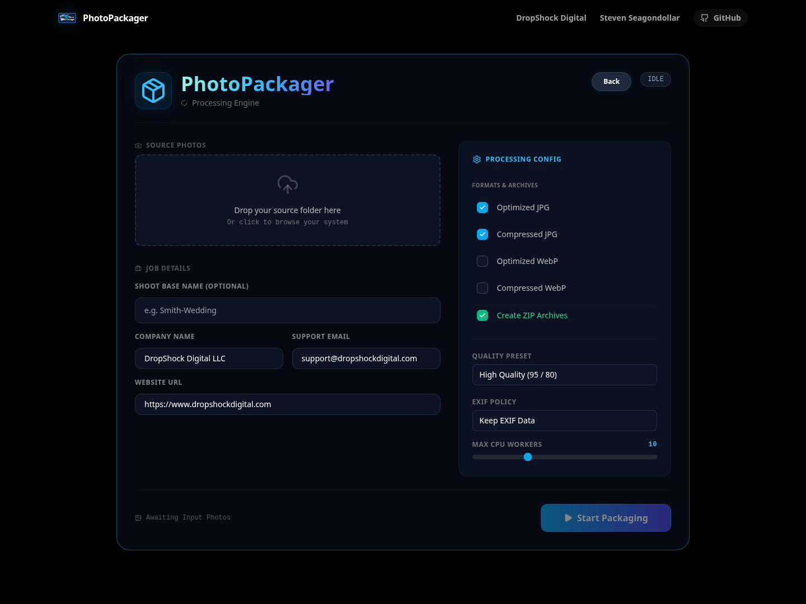

# PhotoPackager

<p align="center">
  
</p>

<p align="center"><strong>Turn a finished shoot into a clear, client-ready package — without manually sorting copies, exports, ZIPs, and metadata settings every time.</strong></p>

> **Review copy only.** This proposed README lives on `docs/readme-brand-draft`. It does not replace `README.md`, change the official PhotoPackager logo, change project visibility, or make a deployment claim.

A photo delivery should not require rebuilding the same folder structure by hand after every shoot. PhotoPackager helps photographers turn a source folder into deliberate deliverables: preserved originals when wanted, optimized or compressed variants, an EXIF policy, readable folders, and ZIP packages for handoff.

**Worth trying if:** you repeatedly prepare client photo deliveries and want a repeatable process that you can run on your own computer before sharing anything.

## Choose the right way to run it

| Use this | When you want | Where the photos are processed |
| --- | --- | --- |
| **Desktop / CLI** | The clearest privacy boundary and full local control | Your computer |
| **Local Docker web app** | Browser convenience while keeping the service on your own computer | Your computer, at `localhost` |
| **Current hosted web app** | A public browser test surface | **Server-side today** — files upload to the web/API service for processing and download |

> **Important:** the hosted web path is not browser-local processing today. Do not upload client media there unless you intentionally accept server-side upload, processing, and download. The public PhotoPackager URL was unavailable during the latest read-only check; this draft does not claim it is live.



## What it helps you deliver

- Organized delivery folders instead of one loose export pile
- Original, optimized JPG, WebP, and compressed variants when selected
- EXIF preserve, remove, or strip choices
- ZIP packages for the versions you decide to share
- Dry runs before output is written
- Desktop, command-line, local web, and MCP entry points over the same packaging engine

It is **not** a gallery host, backup system, client contract, or substitute for reviewing a package before delivery.

## See the interface



This is a local, no-client-media fixture capture of the browser workflow. It shows the interface only; it does not prove a hosted deployment.

## Hosted demo availability

[PhotoPackager on the web](https://photopackager.dropshockdigital.com/) may be available without local setup. It is a cost-controlled hosted demo, not the recommended path for client media. Hosting may be paused when it is not actively maintained; if the URL returns a 404, email [support@dropshockdigital.com](mailto:support@dropshockdigital.com) to request that it be brought online.

## Try it locally

### Easiest browser path: run the container on your own computer

```bash
git clone https://github.com/DropShock-Digital/PhotoPackager.git
cd PhotoPackager
docker compose up --build
```

Then open <http://localhost:5601>. The browser talks to a service running on **your own computer**; the Compose stack starts the web/API service, Redis, and the background worker locally.

### Command line and verification

```bash
python3.11 -m venv .venv
source .venv/bin/activate
python -m pip install --upgrade pip
pip install -r requirements.txt -r requirements-dev.txt
python app.py cli --help
python -m pytest -v
```

### Frontend development

```bash
cd frontend
npm ci
npm run lint
npm run build
```

## Keep client media under your control

Photo files can contain faces, locations, camera identifiers, and client information.

- Prefer desktop, CLI, or the local Docker workflow for real client media.
- Review EXIF settings and inspect every generated package before sharing it.
- Keep originals outside the output directory and inside your normal backup system.
- Generated packages and temporary uploads are intentionally excluded from Git.
- Do **not** treat the current web/API service as production-ready multi-tenant storage or a public client upload portal.

The included web stack does not provide production-ready authentication, authorization, multi-tenant isolation, retention controls, or a proven zero-retention policy by default. A hosted version needs a separate privacy, authentication, storage-lifecycle, cost, and deployment design before it should process client media.

## How the repository is organized

| Path | Role |
| --- | --- |
| `job.py` and `image_processing.py` | Core packaging workflow |
| `app.py` | Desktop and command-line launcher |
| `main.py` | FastAPI web/API entry point |
| `worker.py` | Celery background worker |
| `mcp_tools.py` | MCP-facing tools |
| `frontend/` | React web interface |
| `tests/` | Automated test suite |

## Contributing and security

See [CONTRIBUTING.md](CONTRIBUTING.md). Report security concerns through [SECURITY.md](SECURITY.md), not in a public issue. Do not commit client photos, generated packages, credentials, local databases, build artifacts, or private AI context.

## License

PhotoPackager is available under the [MIT License](LICENSE).

Built by [DropShock Digital](https://dropshockdigital.com) and Steven Seagondollar.
